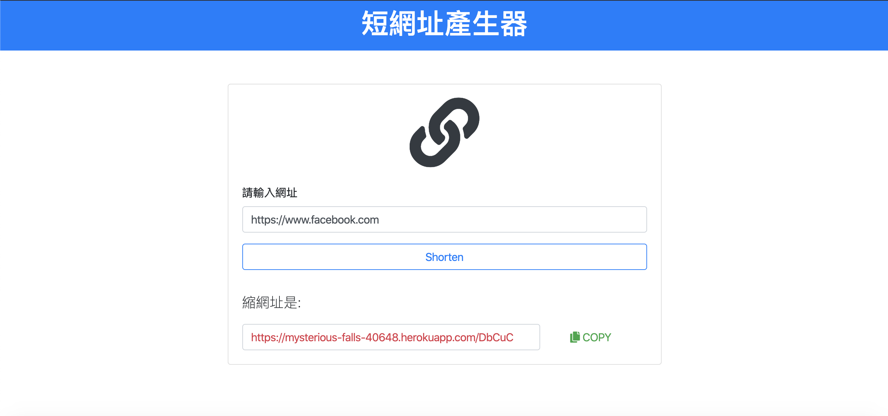

# 短網址產生器 - Mongoose

使用 Node.js + Express + MongoDb 打造的縮網址程式網站，使用者可以在表單輸入原始網址後，送出表單之後，畫面會回傳格式化後的短網址

## Features - 產品功能

- 使用者可以在表單輸入原始網址
- 使用者送出表單之後，畫面會回傳格式化後的短網址
- 使用者可以複製格式化後的短網址
- 使用者貼上短網址後，會指向原始網站
- 使用者沒有輸入任何網址時，會顯示告知使用者錯誤訊息
- 使用網址格式輸入錯誤時，會顯示提示，並且無法送出
- 使用者可以連續產生不同的短網址

## Environment SetUp - 環境建置

- node.js v10.16.0
- express 4.17.1
- express-handlebars 3.1.0
- body-parser 1.19.0
- nodemon 1.19.1
- clipboard 2.0.4
- express-validator 6.3.0
- mongoose 5.7.12

## Installing - 專案安裝流程

1. 安裝 MongoDB
##### 至 MongoDB 下載，完成後更名為mongodb後移至專案資料夾目錄，並於同一層建立mongodb-data資料夾。 接著開啟終端機並輸入，此終端機請務必保持開啟
```
$ cd 專案資料夾位址/mongodb/bin
$ ./mongod --dbpath /Users/[使用者名稱]/專案資料夾位址/mongodb-data
```
##### 可利用圖形化介面工具 [Robo 3T](https://robomongo.org/download) 操作資料庫


2. 打開你的 terminal，Clone 此專案至本機電腦

```
 https://github.com/lesterhua/SEM3-S9-A30-Final-Exam-URL-shortenert.git
```

3. 開啟終端機(Terminal)，進入存放此專案的資料夾

```
cd URL-shortenert
```

4. 安裝 npm 套件

```
在 Terminal 輸入 npm install 指令
```

5. 執行專案

```
在 Terminal 輸入 npm run dev  指令
```

#### 安裝成功後，會在終端機看到訊息"Express is running on :http://localhost:3000


## Heroku - 部署
https://mysterious-falls-40648.herokuapp.com/

## 畫面 - Demo




## 作者 - Authors

[Lester](https://github.com/lesterhua)
